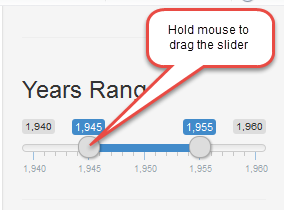
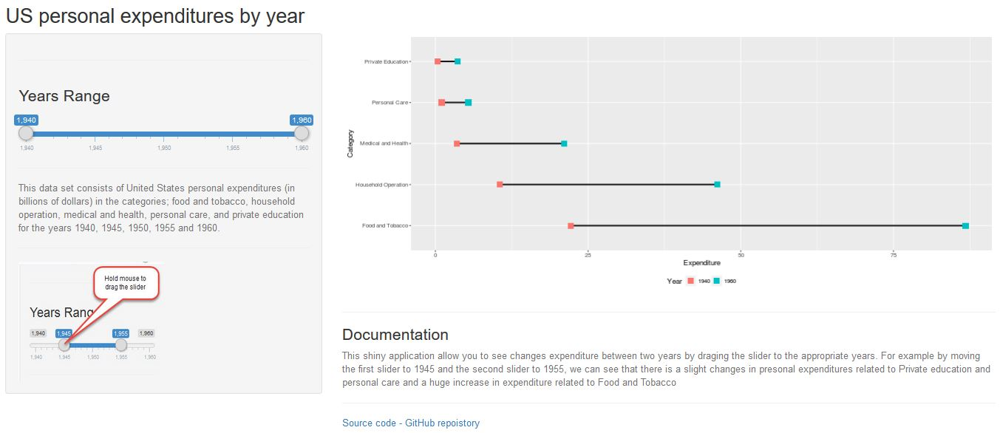

US Personal Expenditures
========================================================
author: Amo2002
date:  2016-03-26
autosize: true

Overview
========================================================
The Shiny application listed below was created to illustrate the amount of US personal expenditure increase or decrease between two range of years, targeting years 1940, 1945, 1950, 1955 and 1960 for:

- Food Tabacco
- Household operation 
- medical and health
- personal care 
- private education 

<https://amo2002.shinyapps.io/USPexpenditure/>


Functionality
========================================================


This shiny application allow you to see changes expenditure between two years by  draging the slider to the appropriate years. For example by moving the first slider to 1945 and the second slider to 1955, we can see that there is a slight changes in presonal expenditures related to Private education and personal care and a huge increase in expenditure related to Food and Tobacco.

</img>


Source Data 
========================================================


```r
data <- as.data.frame(USPersonalExpenditure)
head(data)
```

```
                      1940   1945  1950 1955  1960
Food and Tobacco    22.200 44.500 59.60 73.2 86.80
Household Operation 10.500 15.500 29.00 36.5 46.20
Medical and Health   3.530  5.760  9.71 14.0 21.10
Personal Care        1.040  1.980  2.45  3.4  5.40
Private Education    0.341  0.974  1.80  2.6  3.64
```


How the application works
========================================================
A Shiny application is simply a directory that contain mainly two kind of files:


server.R  control what the appliction does

  - The graph is automatically updated by monitoring the sliders for changes in user input.

  - Once a change is detected, the  algorithm is re-run and the graph is re-plotted.

ui.R control how it looks

  - Used renderPlot to render the ggplot 
  
  
  
User Interface
=========================================================

</img>
